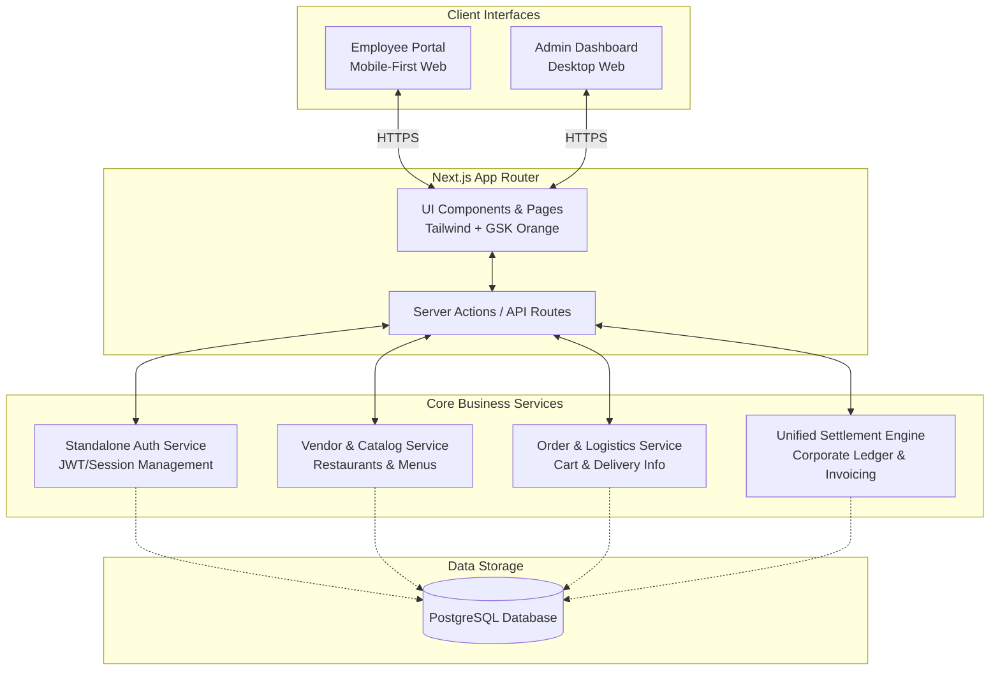

---
stepsCompleted:
  - step-01-init
  - step-02-context
  - step-03-architecture
inputDocuments:
  - e:\MyCode\bmad\_bmad-output\planning-artifacts\prd.md
  - e:\MyCode\bmad\_bmad-output\planning-artifacts\ux-design-specification.md
documentCounts:
  prdCount: 1
  uxCount: 1
workflowType: 'architecture'
project_name: 'bmad Corporate Food Ordering'
user_name: 'Gordon'
date: '2026-03-17'
---

# Architecture Decision Document

_This document builds collaboratively through step-by-step discovery. Sections are appended as we work through each architectural decision together._

## Step 1: Initialization

Project architecture initialized. The following context documents have been loaded and analyzed to form the foundation of our technical decisions:
- **Product Requirements Document (PRD):** Defines the standalone nature of the app, unified settlement requirements, and targeted onboarded restaurants.
- **UX Design Specification:** Outlines the mobile-first employee portal, desktop admin dashboard, and the vibrant orange (GSK) UI component guidelines.

---

## Step 2: Discovery & Executive Summary

### Requirements Overview

**Functional Requirements:**
- **Standalone Authentication:** An independent identity system fully decoupled from existing corporate OA/HR infrastructure.
- **Unified Billing & Settlement:** A centralized engine that intercepts typical user payment gateways and routes costs to a corporate ledger.
- **Vendor & Catalog Management:** Curated menus for specific onboarded local restaurants.
- **Flexible Delivery Logistics:** Custom delivery instructions mapped to internal corporate campus locations.
- **Admin Invoicing Dashboard:** Aggregated data visualization and export capabilities for finance managers.

**Non-Functional & UX Requirements:**
- **Mobile-First Employee UI:** Responsive web application optimized for on-the-go ordering.
- **Desktop Admin UI:** Data-dense, efficient interface for end-of-month reconciliation.
- **Design System:** Strict adherence to the GSK vibrant orange color palette for primary actions and brand trust.
- **Performance:** End-to-end order placement must take under 3 minutes, requiring fast UI interactions and optimistic state updates.

### Scale & Complexity
- **Primary Domain:** Full-Stack Web Application (B2B SaaS model with consumer-like UX).
- **Complexity Level:** Medium. The complexity lies primarily in the unified settlement routing and standalone identity management, not in massive concurrent user scale.
- **Cross-Cutting Concerns:** Security (standalone auth), multi-tenant data access (employee vs. admin/finance), and robust audit logging for financial transactions.

---

## Step 3: System Architecture & Diagram

### Primary Technology Stack Selection
Based on the requirement for a mobile-first responsive web app, a desktop dashboard, and a unified backend settlement engine, we will utilize a **Next.js (App Router)** full-stack architecture. 

**Rationale:**
- Next.js allows us to serve the mobile employee portal and desktop admin dashboard from the same codebase.
- API Routes (Server Actions) provide a secure, server-side environment to handle the unified settlement logic and standalone authentication without standing up a separate backend immediately.
- Tailwind CSS will be configured to strictly enforce the GSK vibrant orange design system across all components.

### High-Level System Architecture Diagram

### Component Breakdown
1. **Client Interfaces:** Server-side rendered (SSR) React components using Next.js. The Employee Portal focuses on fluid, mobile-friendly navigation, while the Admin Dashboard prioritizes data tables and export functionalities.
2. **Standalone Auth Service:** Manages user registration, login, and session tokens independently of corporate active directories.
3. **Unified Settlement Engine:** The financial core. It intercepts the checkout flow, bypasses credit card processing, validates against daily corporate budgets, and records the transaction to the centralized invoice ledger.
4. **Data Storage:** A relational database (e.g., PostgreSQL) is required to ensure ACID compliance for the settlement and ledger transactions. For the MVP, we will rely exclusively on PostgreSQL and Next.js native caching mechanisms, eliminating the need for a separate Redis instance to simplify the initial deployment architecture.

---

## Step 4: Data Architecture & Models

To guarantee financial integrity for the unified settlement process, a normalized relational database schema (PostgreSQL) is mandated.

### Core Entities

**1. Users (Employees & Admins)**
- `id` (UUID, Primary Key)
- `email` (String, Unique)
- `password_hash` (String)
- `role` (Enum: EMPLOYEE, ADMIN)
- `default_delivery_location` (String, Optional)
- `daily_budget_allowance` (Decimal, nullable if inherited from global policy)
- `created_at`, `updated_at`

**2. Restaurants (Vendors)**
- `id` (UUID, Primary Key)
- `name` (String)
- `description` (Text)
- `image_url` (String)
- `is_active` (Boolean)
- `operating_hours` (JSONB)
- `created_at`, `updated_at`

**3. Menu Items**
- `id` (UUID, Primary Key)
- `restaurant_id` (UUID, Foreign Key)
- `name` (String)
- `description` (Text)
- `price` (Decimal, Precision 10, Scale 2)
- `image_url` (String)
- `is_available` (Boolean)

**4. Orders**
- `id` (UUID, Primary Key)
- `user_id` (UUID, Foreign Key)
- `restaurant_id` (UUID, Foreign Key)
- `status` (Enum: PENDING, CONFIRMED, PREPARING, OUT_FOR_DELIVERY, DELIVERED, CANCELLED)
- `total_amount` (Decimal, Precision 10, Scale 2)
- `delivery_location` (String)
- `delivery_instructions` (Text)
- `settlement_status` (Enum: UNBILLED, BILLED, DISPUTED)
- `created_at`, `updated_at`

**5. Order Items**
- `id` (UUID, Primary Key)
- `order_id` (UUID, Foreign Key)
- `menu_item_id` (UUID, Foreign Key)
- `quantity` (Integer)
- `unit_price_at_time` (Decimal) /* Crucial for immutable financial records */

**6. Invoices / Settlement Ledger**
- `id` (UUID, Primary Key)
- `billing_period_start` (Date)
- `billing_period_end` (Date)
- `total_amount` (Decimal)
- `status` (Enum: DRAFT, FINALIZED, EXPORTED)
- `generated_by` (UUID, Admin User)
- `created_at`

**7. Complaints / Reviews**
- `id` (UUID, Primary Key)
- `order_id` (UUID, Foreign Key, Unique per order)
- `user_id` (UUID, Foreign Key)
- `rating` (Integer, 1-5)
- `comment` (Text)
- `status` (Enum: OPEN, RESOLVED)
- `created_at`

---

## Step 5: API & Integration Strategy

Given the Next.js App Router architecture, we will primarily leverage **Server Actions** for mutations (creating orders, updating settings) to ensure secure, server-side execution without exposing standalone REST endpoints. Traditional REST/API Routes (`/api/*`) will be used sparingly, primarily for external exports or webhooks.

### Key Server Actions / API Flows

- **Authentication Flow:** `POST /api/auth/login` (Standard JWT or encrypted cookie session creation).
- **Catalog Operations:** `GET /api/restaurants` (Leveraging Next.js caching/ISR for rapid loading of the vibrant, image-heavy employee UI).
- **The Unified Settlement Action (Checkout):** 
  - A transactional Server Action: `placeCorporateOrder(cartPayload, deliveryInfo)`.
  - Begins a PostgreSQL transaction.
  - Validates user budget.
  - Creates the `Order` and `OrderItems`.
  - Marks `settlement_status` as `UNBILLED`.
  - Commits transaction. (Rolls back if budget exceeded or menu items unavailable).
- **Admin Capabilities:** `GET /api/admin/invoices/export` (Generates a CSV or PDF aggregation of all orders within a date range for finance reconciliation).

---

## Step 6: Deployment & Security Architecture

### Deployment Strategy
As a standalone Next.js application, deployment should be streamlined and highly available:
- **Application Hosting:** Vercel or a containerized environment (Docker/Kubernetes on AWS/Azure) depending on internal corporate IT policies.
- **Database Hosting:** Managed PostgreSQL (e.g., Supabase, AWS RDS, or Azure Database for PostgreSQL) to ensure automated backups, high availability, and Point-in-Time Recovery (PITR) for financial data.

### Security Posture
- **Identity & Access Management (IAM):** Role-Based Access Control (RBAC) enforced at the API/Server Action level. Employees cannot access `/admin` routes or actions.
- **Data Protection:** 
  - All data in transit encrypted via TLS 1.3.
  - Sensitive data at rest (passwords) hashed via Argon2 or bcrypt.
- **Financial Auditability:** The `Order Items` table specifically stores `unit_price_at_time` to ensure that if a restaurant changes a price tomorrow, yesterday's financial settlement ledger remains immutable and accurate.
- **State Integrity:** Order placement logic must execute entirely server-side (Server Actions) to prevent client-side manipulation of totals or bypassing the unified settlement logic.